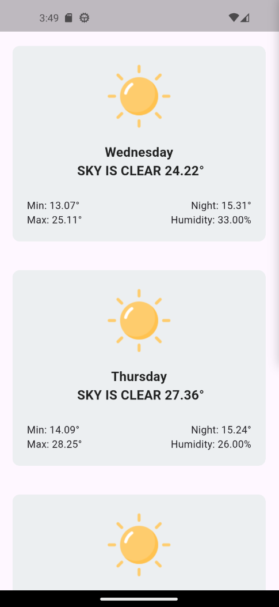

# Weather App

A simple 7-day weather forecast application built with Flutter.
It automatically detects the user's current location and displays the weather forecast for the next seven days.

## Features

- Automatically detects the user's current city
- Displays a 7-day weather forecast
- Shows:
  - Current temperature
  - Minimum temperature
  - Maximum temperature
  - Night temperature
  - Humidity
  - Weather icon
- API key is securely injected using `--dart-define`

## Tech Stack

- Flutter
- Dart
- Dio
- Geolocator
- Geocoding
- CollectAPI

## Getting Started

Install dependencies:

```bash
flutter pub get
```

Run the app:

```bash
flutter run --dart-define=COLLECT_API_KEY=YOUR_API_KEY
```

## Screenshot


